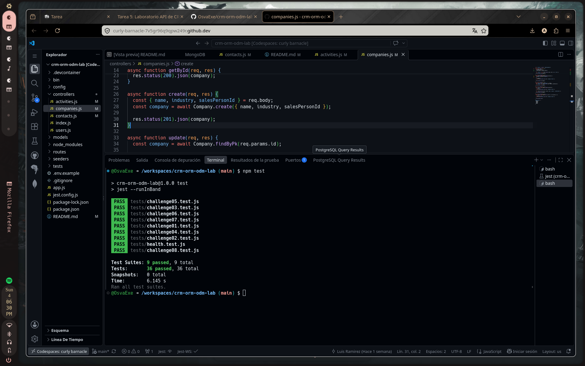

# CRM ORM/ODM Lab

API REST de un CRM básico que combina un ORM (Sequelize + PostgreSQL) y un ODM (Mongoose + MongoDB).

## Stack

- Node.js 22, Express 5, CommonJS
- Sequelize + PostgreSQL 16 (`User`, `Company`, `Contact`)
- Mongoose + MongoDB 7 (`Activity`)
- Jest + Supertest
- GitHub Codespaces, Dev Containers, Docker Compose
- Supervisor (`npm run dev`)

## Arquitectura

```text
GitHub Codespace
│
├── app       Node.js 22  ──┬── Sequelize ──> postgres (PostgreSQL)
│                           └── Mongoose  ──> mongo    (MongoDB)
├── postgres
└── mongo
```

La aplicación se conecta por nombre de servicio (`postgres`, `mongo`). Las credenciales de desarrollo llegan como variables de entorno definidas en `.devcontainer/docker-compose.yml` (ver `.env.example`).

## Iniciar el Codespace

1. En GitHub: **Code → Codespaces → Create codespace on main**.
2. Espera a que se levanten los tres servicios (`app`, `postgres`, `mongo`). `postCreateCommand` ejecuta `npm install`.

## Instalar dependencias

```bash
npm install
```

## Seed y reset

```bash
npm run seed    # inserta datos deterministas (3 users, 4 companies, 8 contacts, 10 activities)
npm run reset   # elimina y recrea tablas/base de datos y vuelve a sembrar
```

## Iniciar la API

```bash
npm start       # node ./bin/www
npm run dev     # supervisor ./bin/www
```

Servidor en el puerto `3000` (variable `PORT`).

## Pruebas

```bash
npm test
```

Cada suite restablece PostgreSQL y MongoDB antes de ejecutarse y cierra las conexiones al terminar.

## Endpoints

| Método | Ruta | Descripción |
|---|---|---|
| GET | `/health` | Health check |
| GET | `/users` | Listar usuarios |
| GET | `/users/:id` | Obtener usuario |
| POST | `/users` | Crear usuario |
| PUT | `/users/:id` | Actualizar usuario |
| DELETE | `/users/:id` | Eliminar usuario |
| GET | `/companies` | Listar compañías (`?industry=`) |
| GET | `/companies/:id` | Obtener compañía |
| POST | `/companies` | Crear compañía |
| PUT | `/companies/:id` | Actualizar compañía |
| DELETE | `/companies/:id` | Eliminar compañía |
| GET | `/contacts` | Listar contactos |
| GET | `/contacts/:id` | Obtener contacto |
| POST | `/contacts` | Crear contacto |
| PUT | `/contacts/:id` | Actualizar contacto |
| DELETE | `/contacts/:id` | Eliminar contacto |
| GET | `/activities` | Listar actividades (`?type=`) |
| GET | `/activities/:id` | Obtener actividad |
| POST | `/activities` | Crear actividad |
| PUT | `/activities/:id` | Actualizar actividad |
| DELETE | `/activities/:id` | Eliminar actividad |

Los errores se devuelven como JSON: `{ "error": "Contact not found" }`.

## Respuestas

1. Dos motores.
Activity es buen candidato para una base documental porque su campo metadata cambia de forma según el tipo (CALL guarda duration/result, EMAIL subject/opened, MEETING location/attendees); un documento con esquema flexible absorbe esas variaciones sin alterar tablas. Company y Contact encajan en una base relacional porque tienen una estructura fija y una relación clara 1–N entre ellas, que PostgreSQL representa con llaves foráneas e integridad referencial.

2. ORM vs ODM.
Un ORM (Object-Relational Mapping) traduce entre objetos del código y filas de tablas relacionales; aquí es Sequelize sobre PostgreSQL. Un ODM (Object-Document Mapping) hace lo mismo pero contra documentos de una base NoSQL; aquí es Mongoose sobre MongoDB. Una diferencia importante: el ORM trabaja sobre un esquema rígido con tablas y JOINs, mientras que el ODM maneja documentos flexibles y relaciona por referencias/embebidos en lugar de JOINs.

3. Configuración por variables de entorno.
Las credenciales se definen en variables de entorno (archivo .env, a partir de .env.example), que el Codespace ya provee; config/sequelize.js y config/mongoose.js las leen con process.env. Escribirlas dentro de los .js es mala práctica porque quedarían versionadas en el repositorio (expuestas) y obligarían a tocar código para cambiar de entorno. La app se conecta a DB_HOST=postgres y MONGODB_URI=mongodb://mongo:27017/crm: no son localhost porque cada base corre en su propio contenedor y Docker Compose las resuelve por el nombre del servicio (postgres, mongo), no en la misma máquina que la app.

4. Asociaciones.
Según models/sequelize/index.js, Company tiene muchos Contact (Company.hasMany(Contact, ...)) y cada Contact pertenece a una Company (Contact.belongsTo(Company, ...)): una relación 1–N. La llave foránea es companyId y vive en la tabla contacts. El alias as: 'contacts' nombra la asociación para poder incluirla en las consultas (por ejemplo, el include del Reto 05) y para que la propiedad devuelta se llame contacts.

5. Eager loading.
Hacer dos consultas (primero la compañía y luego sus contactos) implica dos viajes a la base de datos y coordinarlos en el código. Con include (eager loading) Sequelize trae la compañía y sus contactos en una sola consulta mediante un JOIN. Es preferible el include: menos llamadas a la base, respuesta ya armada y evita el problema N+1 consultas.

6. Instancia vs consulta.
Buscar la instancia y luego instancia.update() devuelve el registro actualizado como objeto, dispara validaciones y hooks del modelo, y permite responderlo directamente (es lo que hago en el Reto 07). Model.update({...}, { where }) actualiza en un solo query pero devuelve el número de filas afectadas, no el registro; es más eficiente para actualizaciones masivas, pero si necesitas devolver el objeto tendrías que consultarlo después.

7. Esquema flexible.
metadata usa mongoose.Schema.Types.Mixed (con default: {}), un tipo que acepta cualquier estructura, por eso guarda formas distintas para CALL, EMAIL y MEETING sin definir cada campo. La desventaja es que Mongoose no valida ni tipa su contenido: puede entrar cualquier cosa, se pierde consistencia y hay que marcarlo como modificado para que detecte cambios internos.

8. Sin ref.
contactId y userId son números que apuntan a registros de PostgreSQL, no a documentos de MongoDB; ref/populate solo funciona entre colecciones del mismo MongoDB, por eso no aplica aquí. La consecuencia es que no hay integridad referencial entre ambas bases: si se elimina un User en PostgreSQL, las actividades seguirán guardando su userId y quedarían apuntando a un usuario inexistente (referencia huérfana).

9. Documento actualizado.
Antes de la corrección, findByIdAndUpdate(id, req.body) devolvía el documento tal como estaba antes del cambio, porque esa es la opción por defecto de Mongoose. Lo resolví agregando las opciones { new: true, runValidators: true }: new: true hace que devuelva el documento ya actualizado y runValidators: true valida los datos nuevos contra el esquema (archivo controllers/activities.js, función update).

10. Pruebas de comportamiento.
Probar el comportamiento (la respuesta HTTP de la API) y no la implementación permite resolver cada reto de la forma que uno quiera: mientras el endpoint responda lo esperado, la prueba pasa. Así el código se puede refactorizar sin romper las pruebas, y estas verifican lo que realmente le importa al cliente de la API.

11. Repetibilidad.
tests/setup.js abre las conexiones a PostgreSQL y MongoDB y ejecuta reset() del seeder antes de cada suite (beforeAll), dejando siempre los mismos datos conocidos; después (afterAll) cierra las conexiones. Es necesario porque, si una prueba crea o modifica datos, la siguiente partiría de un estado distinto; restablecer la base garantiza que npm test dé el mismo resultado cada vez.

12. Tu experiencia.
El más difícil fue el Reto 08: las pruebas pasaban la persistencia pero fallaban al comparar la respuesta, porque findByIdAndUpdate devuelve por defecto el documento viejo. El mensaje de Jest expect(received).toBe('Llamada actualizada') mostrando la descripción anterior me señaló que el problema estaba en lo que devolvía la operación, no en el guardado; agregar { new: true } lo resolvió.

## Evidencia


## Evidencia


